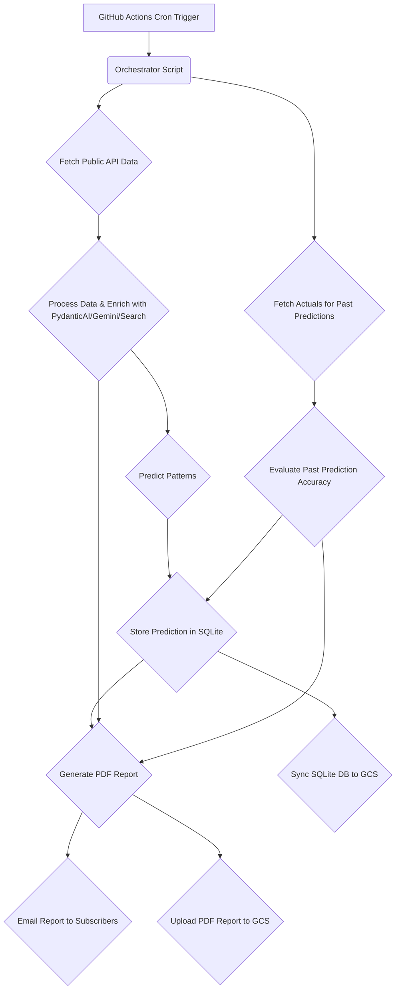

# Project Prompt
# smart-invest
**Organization:** HappyPathway

## 1. Overview

`smart-invest` is a Python-based application designed for automated analysis of trade and investment data. It fetches data from various public APIs and databases, leverages AI (Gemini via PydanticAI) and Google Search for insights and data enrichment, predicts market patterns, and generates daily PDF reports. These reports, which include a self-assessment of past prediction accuracy, are then emailed to subscribers. The entire process is orchestrated to run as a scheduled cron job using GitHub Actions, with data persistence managed via SQLite and Google Cloud Storage (GCS).

## 2. Features

- **Automated Data Ingestion:** Fetches financial data from configurable public APIs and databases.
- **AI-Powered Analysis:** Uses PydanticAI to interact with Gemini and Google Search for advanced data analysis and insight generation.
- **Pattern Prediction:** Implements models to predict potential investment patterns and trends.
- **Self-Assessment & History Tracking:** Records investment predictions, compares them against actual outcomes, and grades its own accuracy over time.
- **PDF Reporting:** Generates comprehensive daily PDF reports summarizing findings, predictions, and self-assessment scores.
- **Email Notifications:** Distributes PDF reports to a list of subscribers.
- **Scheduled Execution:** Runs automatically on a configurable schedule (e.g., daily) via GitHub Actions.
- **Persistent Storage:** Utilizes SQLite for local/intermediate data storage and Google Cloud Storage (GCS) for long-term backup and retrieval of data and reports.
- **Modular Architecture:** Designed with distinct modules for different functionalities (data fetching, analysis, prediction, reporting, etc.).

## 3. Architecture

The application follows a modular, pipeline-like architecture orchestrated by a main script run via GitHub Actions:

1.  **Data Ingestion Agent:** Fetches raw data from specified public APIs (e.g., financial market data, news APIs).
2.  **Data Processing & Enrichment Agent:** Cleans, transforms, and enriches the data. This agent utilizes PydanticAI to query Gemini and Google Search for contextual information, sentiment analysis, or relevant news.
3.  **Pattern Prediction Agent:** Applies statistical models or machine learning algorithms to the processed data to identify potential patterns or make predictions.
4.  **Prediction Storage & Evaluation Agent:** Stores new predictions in the SQLite database. Retrieves past predictions and compares them with newly fetched actual market data to calculate an accuracy score.
5.  **Reporting Agent:** Compiles all information (current analysis, new predictions, past prediction accuracy) into a structured PDF report (likely using WeasyPrint from an HTML template).
6.  **Notification Agent:** Emails the generated PDF report to a list of subscribers.
7.  **Storage Synchronization Agent:** Periodically (e.g., daily after report generation) backs up the SQLite database and generated reports to Google Cloud Storage.



## 4. Tech Stack

- **Programming Language:** Python 3.12+
- **Data Validation & Settings:** Pydantic (v2.x)
- **LLM & Search Integration:** PydanticAI
- **Database:** SQLite (with SQLAlchemy 2.0.x for ORM and Alembic for migrations)
- **Data Manipulation & Analysis:** Pandas (v2.x), NumPy
- **Machine Learning/Statistics:** Scikit-learn (or other relevant libraries like Statsmodels, TensorFlow/PyTorch for more complex models)
- **PDF Generation:** WeasyPrint (recommended), ReportLab
- **Emailing:** `smtplib`, `email.mime` (Python standard library)
- **HTTP Requests:** `httpx` (for asynchronous API calls)
- **Cloud Storage:** Google Cloud Storage (`google-cloud-storage` library)
- **Automation/CI/CD:** GitHub Actions
- **Dependency Management:** Poetry (recommended) or PDM
- **Testing:** `pytest`, `pytest-cov`
- **Linting/Formatting:** Ruff
- **Environment Variables:** `python-dotenv` (for local development)

## 5. Prerequisites

- Python 3.12 or later.
- Poetry (or PDM) installed globally.
- Google Cloud Platform (GCP) account with a GCS bucket created.
- GCP credentials configured for application (e.g., via Application Default Credentials or a service account JSON key).
- API keys for any public data sources and for Gemini (Google AI Studio).
- SMTP server credentials if using a custom SMTP server for emails.

## 6. Setup & Installation

1.  **Clone the Repository:**
    ```bash
    git clone https://github.com/HappyPathway/smart-invest.git
    cd smart-invest
    ```

2.  **Install Dependencies using Poetry:**
    ```bash
    poetry install
    ```
    *(If using PDM, use `pdm install`)*

3.  **Set Up Environment Variables:**
    Copy the `.env.example` file to `.env` and fill in the required values:
    ```bash
    cp .env.example .env
    # Open .env and add your API keys, GCS details, DB URL, etc.
    ```
    Key variables in `.env` (refer to `src/smart_invest/core/config.py` for all settings):
    - `DATABASE_URL`: e.g., `sqlite+aiosqlite:///./smart_invest.db`
    - `GCS_BUCKET_NAME`: Your GCS bucket name.
    - `GOOGLE_APPLICATION_CREDENTIALS`: Path to your GCS service account key file (if not using ADC).
    - `GEMINI_API_KEY`: Your API key for Gemini.
    - `SUBSCRIBER_EMAILS`: Comma-separated list of email addresses.
    - `SMTP_HOST`, `SMTP_PORT`, `SMTP_USER`, `SMTP_PASSWORD`, `EMAIL_SENDER` (if applicable).
    - Any other API keys for data sources.

4.  **Initialize Database & Run Migrations:**
    The application will use Alembic for database migrations.
    ```bash
    poetry run alembic upgrade head
    ```

## 7. Running the Application

### Local Execution

To run the main application pipeline locally (e.g., for a single execution of the daily job):
```bash
poetry run python src/smart_invest/main.py
```

Specific tasks or agents might be runnable individually for development or debugging purposes (details to be added as CLI commands are developed, e.g., using Typer or Click).

### GitHub Actions Workflow

The application is designed to run as a cron job via GitHub Actions. The workflow is defined in `.github/workflows/daily_run.yml`.
This workflow will typically:
1.  Checkout the code.
2.  Set up Python and install dependencies (cached for speed).
3.  Set up GCS authentication using secrets.
4.  Execute the main application script (`src/smart_invest/main.py`).
5.  Handle any artifacts (e.g., logs, reports if not directly uploaded by the script).

## 8. Configuration

Application configuration is managed via environment variables and Pydantic's `BaseSettings` located in `src/smart_invest/core/config.py`.
See `.env.example` for a template of required environment variables.

## 9. Project Structure (Recommended)

```
smart-invest/
├── .github/                    # GitHub Actions workflows
│   └── workflows/
│       └── daily_run.yml
├── .vscode/                    # VS Code settings (launch.json, settings.json)
├── data/                       # Local data files (e.g., SQLite DB, temporary files)
│   └── smart_invest.db
├── reports/                    # Locally generated PDF reports (before GCS upload)
├── src/
│   └── smart_invest/
│       ├── __init__.py
│       ├── main.py                 # Main script, orchestrator
│       ├── core/
│       │   ├── __init__.py
│       │   ├── config.py           # Pydantic settings
│       │   └── logging_config.py   # Logging setup
│       ├── apis/                   # Clients for external data APIs
│       │   ├── __init__.py
│       │   └── public_api_client.py
│       ├── analysis/               # Data processing, PydanticAI integration
│       │   ├── __init__.py
│       │   └── analyzer.py
│       ├── prediction/             # Pattern prediction models and logic
│       │   ├── __init__.py
│       │   └── predictor.py
│       ├── reporting/              # PDF generation and emailing
│       │   ├── __init__.py
│       │   ├── report_generator.py
│       │   ├── email_service.py
│       │   └── templates/          # HTML templates for PDF reports
│       ├── storage/                # SQLite and GCS interaction logic
│       │   ├── __init__.py
│       │   ├── db_manager.py       # SQLAlchemy session, CRUD operations
│       │   └── gcs_manager.py
│       ├── database/               # SQLAlchemy models and Alembic migrations
│       │   ├── __init__.py
│       │   ├── models.py
│       │   └── alembic/
│       │       └── versions/
│       │   └── alembic.ini
│       └── evaluation/             # Prediction self-grading logic
│           ├── __init__.py
│           └── evaluator.py
├── tests/
│   ├── __init__.py
│   ├── conftest.py               # Pytest fixtures
│   ├── test_analysis.py
│   └── ...                     # Other test files
├── .env.example                # Example environment variables
├── .gitignore
├── poetry.lock
├── pyproject.toml              # Poetry/PDM project configuration
├── README.md
└── alembic.ini                 # Top-level Alembic config (can point to src/...)
```

## 10. Key Modules/Components (Illustrative)

- **`src/smart_invest/main.py`**: Entry point for the application, orchestrates the workflow.
- **`src/smart_invest/core/config.py`**: Defines Pydantic models for application settings, loaded from environment variables.
- **`src/smart_invest/apis/`**: Modules for interacting with various external data APIs.
- **`src/smart_invest/analysis/analyzer.py`**: Handles data transformation, cleaning, and integration with PydanticAI for querying Gemini/Google Search.
- **`src/smart_invest/prediction/predictor.py`**: Implements logic for pattern prediction using statistical or ML models.
- **`src/smart_invest/database/models.py`**: Contains SQLAlchemy ORM models for database tables (e.g., predictions, historical data).
- **`src/smart_invest/storage/db_manager.py`**: Manages database sessions and CRUD operations.
- **`src/smart_invest/storage/gcs_manager.py`**: Handles interactions with Google Cloud Storage (uploading/downloading database backups and reports).
- **`src/smart_invest/reporting/report_generator.py`**: Generates PDF reports from analyzed data and predictions.
- **`src/smart_invest/reporting/email_service.py`**: Sends generated PDF reports to subscribers.
- **`src/smart_invest/evaluation/evaluator.py`**: Contains logic to assess the accuracy of past predictions against actual outcomes.

## 11. Contributing

Contributions are welcome! Please follow these steps:
1.  Fork the repository.
2.  Create a new branch (`git checkout -b feature/your-feature-name`).
3.  Make your changes and commit them (`git commit -m 'Add some feature'`).
4.  Ensure your code passes linting and tests (`poetry run ruff check .`, `poetry run ruff format .`, `poetry run pytest`).
5.  Push to the branch (`git push origin feature/your-feature-name`).
6.  Open a Pull Request.

Please ensure your code is well-documented and includes relevant tests.

## 12. License

This project is licensed under the MIT License - see the `LICENSE` file for details (To be added - assuming MIT for now).

```


## Best Practices


- Modular Design: Structure the application into well-defined, reusable modules for data fetching, analysis, prediction, reporting, and storage to enhance maintainability and testability.

- Data Validation with Pydantic: Utilize Pydantic extensively for validating API responses, configuration data, and internal data structures, ensuring data integrity throughout the application.

- Robust Error Handling & Logging: Implement comprehensive try-except blocks for error handling and use structured logging (e.g., Python's `logging` module) to record application behavior, errors, and important events for easier debugging and monitoring.

- Configuration Management: Externalize all configurations (API keys, database URLs, email settings, GCS paths) using environment variables and `.env` files, managed securely with Pydantic's `BaseSettings`.

- Automated Testing: Develop a comprehensive test suite using `pytest`, including unit tests for individual functions/modules and integration tests for workflows like data processing, prediction logic, and API interactions. Aim for high test coverage.

- CI/CD with GitHub Actions: Automate the entire development lifecycle, including linting, formatting, testing, building, and the scheduled execution of the data analysis and reporting job using GitHub Actions.

- Modern Dependency Management: Employ Poetry or PDM for robust dependency management, ensuring reproducible builds and a clean project environment.

- Asynchronous Operations for I/O: Leverage `asyncio` along with `httpx` for non-blocking I/O operations, especially when fetching data from multiple external APIs, to improve performance and responsiveness.

- Database Schema Management: Use Alembic for managing SQLAlchemy database migrations, allowing for version-controlled and systematic updates to the SQLite database schema.

- Secure Credential Management: Store and manage sensitive information like API keys and GCS credentials securely using GitHub Secrets for Actions and a secure method for local development (e.g., environment variables, Doppler, or HashiCorp Vault). Avoid hardcoding credentials.


## Recommended VS Code Extensions


- ms-python.python

- ms-python.pylance

- charliermarsh.ruff

- eamodio.gitlens

- ms-azuretools.vscode-docker

- streetsidesoftware.code-spell-checker

- visualstudioexptteam.vscodeintellicode

- redhat.vscode-yaml

- esbenp.prettier-vscode


## Documentation Sources


- Python Official Documentation: https://docs.python.org/3/

- Pydantic Documentation: https://docs.pydantic.dev/latest/

- PydanticAI Documentation: https://pydantic.github.io/pydantic-ai/

- SQLAlchemy Documentation (v2.0): https://docs.sqlalchemy.org/en/20/

- Alembic Documentation: https://alembic.sqlalchemy.org/en/latest/

- Pandas Documentation: https://pandas.pydata.org/pandas-docs/stable/

- WeasyPrint Documentation (for PDF generation): https://weasyprint.org/

- ReportLab User Guide (alternative for PDF generation): https://www.reportlab.com/docs/reportlab-userguide.pdf

- GitHub Actions Documentation: https://docs.github.com/en/actions

- Google Cloud Storage Client Libraries for Python: https://cloud.google.com/python/docs/reference/storage/latest

- HTTPX Documentation (for async HTTP requests): https://www.python-httpx.org/

- Requests Documentation (for sync HTTP requests): https://requests.readthedocs.io/en/latest/

- Scikit-learn Documentation: https://scikit-learn.org/stable/

- Poetry Documentation (Dependency Management): https://python-poetry.org/docs/

- PDM Documentation (Alternative Dependency Management): https://pdm-project.org/latest/

- Ruff Linter/Formatter Documentation: https://docs.astral.sh/ruff/


## GitHub Copilot Instructions
# GitHub Copilot Instructions for smart-invest

## Project Context

# Project Prompt


## Best Practices

No best practices provided.


## Recommended VS Code Extensions

No extensions suggested.


## Documentation Sources

No documentation sources provided.


## Best Practices


- Modular Design: Structure the application into well-defined, reusable modules for data fetching, analysis, prediction, reporting, and storage to enhance maintainability and testability.

- Data Validation with Pydantic: Utilize Pydantic extensively for validating API responses, configuration data, and internal data structures, ensuring data integrity throughout the application.

- Robust Error Handling & Logging: Implement comprehensive try-except blocks for error handling and use structured logging (e.g., Python's `logging` module) to record application behavior, errors, and important events for easier debugging and monitoring.

- Configuration Management: Externalize all configurations (API keys, database URLs, email settings, GCS paths) using environment variables and `.env` files, managed securely with Pydantic's `BaseSettings`.

- Automated Testing: Develop a comprehensive test suite using `pytest`, including unit tests for individual functions/modules and integration tests for workflows like data processing, prediction logic, and API interactions. Aim for high test coverage.

- CI/CD with GitHub Actions: Automate the entire development lifecycle, including linting, formatting, testing, building, and the scheduled execution of the data analysis and reporting job using GitHub Actions.

- Modern Dependency Management: Employ Poetry or PDM for robust dependency management, ensuring reproducible builds and a clean project environment.

- Asynchronous Operations for I/O: Leverage `asyncio` along with `httpx` for non-blocking I/O operations, especially when fetching data from multiple external APIs, to improve performance and responsiveness.

- Database Schema Management: Use Alembic for managing SQLAlchemy database migrations, allowing for version-controlled and systematic updates to the SQLite database schema.

- Secure Credential Management: Store and manage sensitive information like API keys and GCS credentials securely using GitHub Secrets for Actions and a secure method for local development (e.g., environment variables, Doppler, or HashiCorp Vault). Avoid hardcoding credentials.


## Recommended VS Code Extensions


- ms-python.python

- ms-python.pylance

- charliermarsh.ruff

- eamodio.gitlens

- ms-azuretools.vscode-docker

- streetsidesoftware.code-spell-checker

- visualstudioexptteam.vscodeintellicode

- redhat.vscode-yaml

- esbenp.prettier-vscode


## Documentation Sources


- Python Official Documentation: https://docs.python.org/3/

- Pydantic Documentation: https://docs.pydantic.dev/latest/

- PydanticAI Documentation: https://pydantic.github.io/pydantic-ai/

- SQLAlchemy Documentation (v2.0): https://docs.sqlalchemy.org/en/20/

- Alembic Documentation: https://alembic.sqlalchemy.org/en/latest/

- Pandas Documentation: https://pandas.pydata.org/pandas-docs/stable/

- WeasyPrint Documentation (for PDF generation): https://weasyprint.org/

- ReportLab User Guide (alternative for PDF generation): https://www.reportlab.com/docs/reportlab-userguide.pdf

- GitHub Actions Documentation: https://docs.github.com/en/actions

- Google Cloud Storage Client Libraries for Python: https://cloud.google.com/python/docs/reference/storage/latest

- HTTPX Documentation (for async HTTP requests): https://www.python-httpx.org/

- Requests Documentation (for sync HTTP requests): https://requests.readthedocs.io/en/latest/

- Scikit-learn Documentation: https://scikit-learn.org/stable/

- Poetry Documentation (Dependency Management): https://python-poetry.org/docs/

- PDM Documentation (Alternative Dependency Management): https://pdm-project.org/latest/

- Ruff Linter/Formatter Documentation: https://docs.astral.sh/ruff/


## Project-Specific Guidelines


- Use asynchronous programming with `asyncio` and `httpx` for efficient data fetching.

- Implement robust error handling and logging throughout the application.

- Employ Pydantic for rigorous data validation at all stages.

- Structure the code into well-defined modules for maintainability.

- Utilize Alembic for database schema management.

- Write comprehensive unit and integration tests using `pytest`.

- Configure GitHub Actions for automated testing, building, and deployment.

- Securely manage API keys and credentials using GitHub Secrets.

- Prioritize code readability and maintainability.

- Follow PEP 8 style guidelines and use Ruff for linting and formatting.


## Helpful Context


- Python Official Documentation: https://docs.python.org/3/

- Pydantic Documentation: https://docs.pydantic.dev/latest/

- PydanticAI Documentation: https://pydantic.github.io/pydantic-ai/

- SQLAlchemy Documentation (v2.0): https://docs.sqlalchemy.org/en/20/

- Alembic Documentation: https://alembic.sqlalchemy.org/en/latest/

- Pandas Documentation: https://pandas.pydata.org/pandas-docs/stable/

- WeasyPrint Documentation (for PDF generation): https://weasyprint.org/

- ReportLab User Guide (alternative for PDF generation): https://www.reportlab.com/docs/reportlab-userguide.pdf

- GitHub Actions Documentation: https://docs.github.com/en/actions

- Google Cloud Storage Client Libraries for Python: https://cloud.google.com/python/docs/reference/storage/latest

- HTTPX Documentation (for async HTTP requests): https://www.python-httpx.org/

- Requests Documentation (for sync HTTP requests): https://requests.readthedocs.io/en/latest/

- Scikit-learn Documentation: https://scikit-learn.org/stable/

- Poetry Documentation (Dependency Management): https://python-poetry.org/docs/

- PDM Documentation (Alternative Dependency Management): https://pdm-project.org/latest/

- Ruff Linter/Formatter Documentation: https://docs.astral.sh/ruff/


